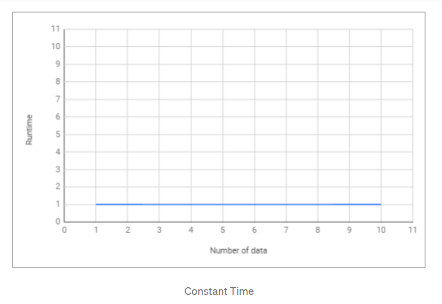
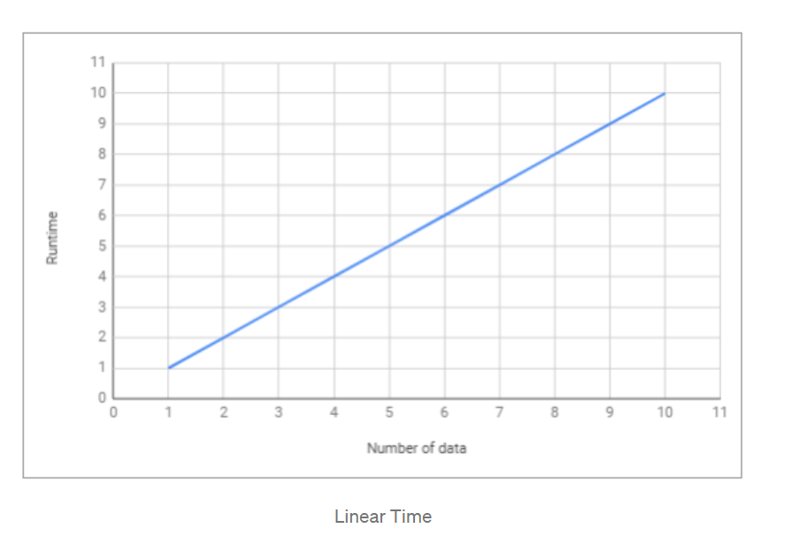
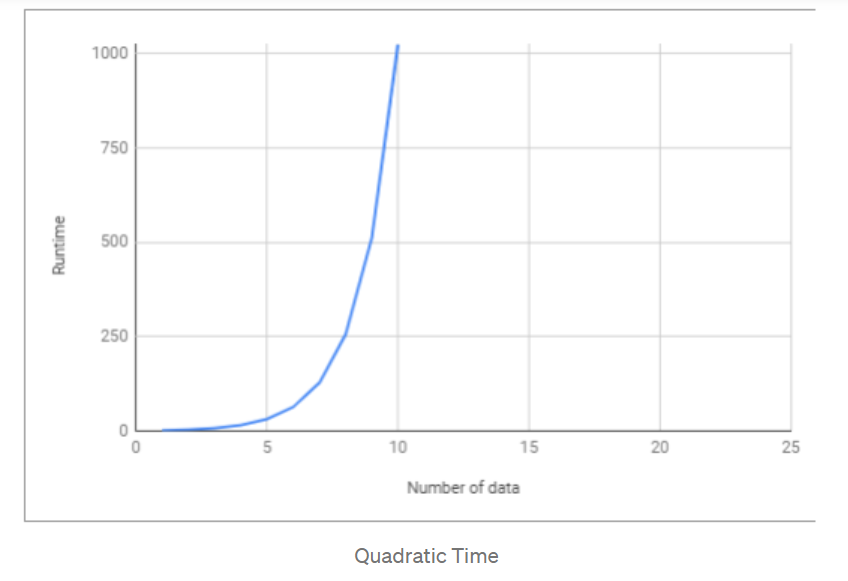
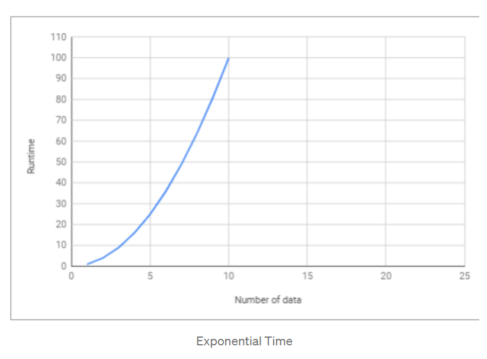

> Nama : Julita Hasanah  
> Nim : 2110131120005

  

<h1 align="center">Penjelasan Sederhana Tentang  Time Complexity dan Big-O Notation </h1>

 

Setiap <i>programmer</i> yang baik akan menggunakan cara yang paling efektif dan efisien dalam menyelesaikan suatu permasalahan. Dan untuk bisa melakukan hal tersebut, <b>kita harus bisa meminimalisir kompleksitas dari algoritma yang kita gunakan.</b>  
Kompleksitas suatu algoritma dibagi menjadi 2, yaitu <b><i>Time Complexity</i></b> dan <b><i>Space Complexity</i></b>.  
<b>Time Complexity</b> adalah seberapa lama waktu yang diperlukan untuk menjalankan suatu algoritma. Sedangkan <b>Space Complexity</b> adalah seberapa besar memori yang kita gunakan untuk menjalankan suatu algoritma.  

## **Algoritma** 

algoritma adalah serangkaian proses yang dilakukan secara berurutan untuk menyelesaikan sebuah permasalahan. Algoritma bisa bermacam-macam tergantung kepada siapa yang membuat algoritma tersebut.   
<b>Time Complexity Analysis</b> adalah suatu cara sederhana untuk mengetahui berapa lama waktu yang dibutuhkan untuk menjalankan suatu algoritma dengan input tertentu (n). Biasanya lebih dikenal dengan sebutan <b>Big-O Notation.</b>  
<b><i>Big O Notation</i></b> digunakan untuk mengukur tingkat kompleksitas suatu algoritma.
 

## **Big-O Notation**

<b>Big-O Notation</b> adalah cara untuk mengkonversi keseluruhan langkah-langkah suatu algoritma kedalam bentuk <b>Aljabar</b>, yaitu dengan menghiraukan konstanta yang lebih kecil dan koefisien yang tidak berdampak besar terhadap keseluruhan kompleksitas permasalahan yang diselesaikan oleh algoritma tersebut. 
Mari kita liat contoh dibawah ini:

    Regular       Big-O
    2             O(1)   --> It's just a constant number
    2n + 10       O(n)   --> n has the largest effect
    5n^2          O(n^2) --> n^2 has the largest effect

Sederhananya, semua contoh yang ada diatas mengatakan bahwa “<b><i>kita hanya akan melihat faktor yang memiliki dampak paling besar terhadap nilai yang dihasilkan oleh algoritma tersebut”.</b></i>  
Terdapat beberapa macam time complexity, diantaranya:  

### **O(1) — Constant Time**

<b>Constant Time</b> artinya banyaknya input yang diberikan kepada sebuah algoritma, tidak akan mempengaruhi waktu proses (runtime) dari algoritma tersebut.

    let myArray = [1, 5, 0, 6, 1, 9, 9, 2];
    function getFirst(input){
        return input[0]; // selalu melakukan 1 langkah
    }
    let firstEl = getFirst(myArray);

Contoh diatas, terdapat sebuah fungsi untuk mengambil elemen pertama dari sebuah input array. Kita bisa melihat bahwa berapapun jumlah array yang diberikan kepada fungsi tersebut, dia akan selalu melakukan 1 hal, yaitu mengambil elemen pertama. Itu artinya <b>jumlah input yang diberikan tidak mempengaruhi waktu proses (<i>runtime</i>) dari algoritma tersebut.</b>
 

 

### **O(log n) — Logarithmic Time**

<b>Logarithmic Time</b> artinya ketika kita memberikan input sebesar n terhadap sebuah fungsi, jumlah tahapan yang dilakukan oleh fungsi tersebut berkurang berdasarkan suatu faktor. Salah satu contohnya adalah algoritma <b>Binary Search</b>.  
<b>Binary Search</b> adalah algoritma yang kita gunakan dalam mencari posisi nilai dari suatu array dengan cara ‘mengeliminasi’ setengah dari array input untuk mempercepat proses pencarian.
 

    let sortedArray = [11, 24, 30, 43, 51, 61, 73, 86];
    function isExists(number, array){
        var midPoint = Math.floor( array.length /2 );
        if( array[midPoint] === num) return true;
        let isFirstHalf = false;
        if( array[midPoint] < num ) isFirstHalf = true;

        else if( array[midpoint] > num ) isFirstHalf = false;
        if (array.length == 1) return false;
        else {
            // memanggil fungsi yang sama dengan mengeleminiasi setengah dari input array
            if (isFirstHalf)
                return isExists(number, getFirstHalf(array));
            else
                return isExists(number, getSecondHalf(array));
        }
    }
    isExists (24, sortedArray); // return true
    isExists (27, sortedArray); // return false

_Note: Fungsi rekursif biasanya Logarithmic_   

### **O(n) — Linear Time** 

<b>Linear Time</b> adalah ketika runtime dari fungsi kita berbanding lurus dengan jumlah input yang diberikan.

    let myArray = [1, 5, 0, 6, 1, 9, 9, 2];
    function getMax(input){
        var max = 0;
        for (var i=0; i<input.length; i++){
            if (max < input[i])
                max = input[i];
        }
        return max;
    }
    let maxNumber = getMax(myArray);

Kita bisa melihat bahwa semakin banyak jumlah input yang diberikan, maka waktu proses/runtime dari fungsi tersebut akan semakin besar.

 

### **O(n²) — Quadratic Time**

<b>Quadratic Time</b> adalah ketika runtime dari fungsi kita adalah sebesar n^2, dimana n adalah jumlah input dari fungsi tersebut. Hal tersebut bisa terjadi karena kita menjalankan <b>fungsi linear didalam fungsi linear</b> (n*n).

    let myArray = [1, 5, 0, 6, 1, 9, 9, 2];
    function sort(input){
        var sortedArray = [];
        for (var i=0; i<input.length; i++){ // O(n)
            let min = input[i];
            for (var j=i+1; i<input.length; i++){ // O(n)
                if (input[i] < input[j])
                    min = input[j];
            }
            sortedArray.push(min);
        }
        return sortedArray;
    }
    let sortedArray = sort(myArray);

### **O(2^n) — Exponential Time**

<b>Exponential Time</b> biasanya digunakan dalam situasi dimana kita tidak terlalu tahu terhadap permasalahan yang dihadapi, sehingga mengharuskan kita mencoba setiap <b>kombinasi</b> dan <b>permutasi</b> dari semua kemungkinan.

## **Kesimpulan**

Sebagai programmer, kita sering kali dihadapkan dengan adanya beberapa solusi untuk sebuah permasalahan dan kita dibingungkan dengan pertanyaan “<b><i>mana solusi yang lebih efisien?</b></i>”.  
Dengan memahami <b>Big-O Notation</b>, kita akan lebih mudah dalam melihat mana algoritma yang lebih efisien yang bisa kita gunakan untuk menyelesaikan permasalahan yang sedang dihadapi.

